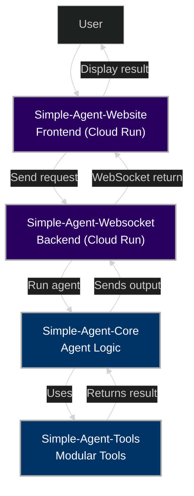

# 🧠 Reagent Systems

**Minimalist AI Agents, Built for Real Use**

Welcome to **Reagent Systems** — a suite of lightweight, modular AI tools designed to be simple to understand, easy to extend, and powerful in execution. Our philosophy: no bloat, no black boxes — just clean, hackable AI agents.

---

## 🚀 Mission

We believe AI agents should be:
- **Simple** – minimal logic, maximum clarity
- **Modular** – tools and components you can mix and match
- **Transparent** – function-driven behavior you can follow and debug

Whether you're deploying to the web, integrating into bots, or building personal tools — Reagent agents are made to be flexible, fast, and open.

---

## 🧩 Core Projects

### [`Simple-Agent-Core`](https://github.com/reagent-systems/Simple-Agent-Core)
> The brain. A minimalist agent framework with a clean loop and pluggable tools.

- 🧠 Focused core logic  
- 🔌 Dynamic tool loading  
- 🔁 Function-based agent actions  
- 🧼 Easy to read, extend, and fork  

---

### [`Simple-Agent-Tools`](https://github.com/reagent-systems/Simple-Agent-Tools)
> The hands. Modular commands for everything from GitHub operations to web scraping.

- 📁 Commands live as isolated files  
- 🔄 Auto-discovered by the core  
- 🌐 Tools for file I/O, GitHub, web search, APIs, and more  
- 📦 Can be loaded locally or over API  

---

### [`Simple-Agent-Websocket`](https://github.com/reagent-systems/Simple-Agent-Websocket)
> The voice. A WebSocket backend that connects frontends to the agent in real time.

- 📡 Listens for incoming messages  
- ⚙️ Runs commands through `Simple-Agent-Core`  
- 🔁 Streams output back to clients  

---

### [`Simple-Agent-Website`](https://github.com/reagent-systems/Simple-Agent-Website)
> The face. A lightweight web UI that sends tasks to the agent via WebSocket.

- 🖥️ Hosted on Google Cloud Run  
- 🔌 Real-time interface  
- 📤 Sends and receives messages from the backend  

---

## 🛠️ Stack

- **Languages:** Python  
- **Infra:** Google Cloud Run  
- **Tooling:** WebSockets, GitHub Actions, Docker  
- **Planned:** Ollama, Claude

---

## 📐 Architecture Overview

## 🤝 Contributing

Want to add a tool? Fix a bug? Make it faster? Sweet.

- Fork a repo  
- Make your changes  
- Open a pull request  
- Describe what’s awesome about it  

Each repo has a `CONTRIBUTING.md` with more details.

---

## 📬 Support

- [Open an issue](https://github.com/reagent-systems/Simple-Agent-Core/issues)  
- Or tag **@bentlybro** on GitHub

---

## 📄 License

MIT License — use it, break it, improve it.  
We believe in open systems that empower developers.

---

> “Build the agent you want to debug.” — *Reagent Systems*  
> “Simplicity is the ultimate sophistication.” — *Leonardo da Vinci*

---

🧪 Built with love by developers who'd rather keep it clean than make it confusing.  
Follow the project, drop feedback, or just vibe with the architecture.

